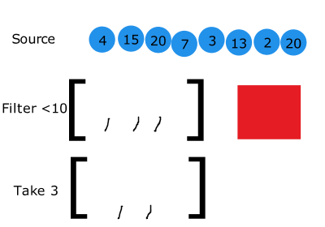

% L'évaluation paresseuse
% (ou comment faire les choses plus tard peut être une bonne idée)
% David Sferruzza

# À propos de moi

- [\@d_sferruzza](https://twitter.com/d\_sferruzza)
- [github.com/dsferruzza](https://github.com/dsferruzza)
- développeur et responsable R&D chez [Escale](http://www.escaledigitale.com)
- doctorant en génie logiciel à l'Université de Nantes
- écrit des projets perso et pro en Scala et en Haskell (notamment) depuis ~ 2 an


# Évaluation paresseuse !=

<figure></figure>

Learn the difference, it could save your life


# Stratégie d'évaluation

- **quand** évaluer les arguments d'un appel de fonction
- **quel type de valeur** passer à la fonction

<figure></figure>


# Évaluation stricte

*strict evaluation, eager evaluation, greedy evaluation*

- **quand :** dès que l'expression peut être liée à une variable
- **quel type de valeurs :**
	- *call by value*
	- *call by reference*
	- *call by sharing*
	- ...


# Évaluation non stricte

*non-strict evaluation, lazy evaluation*

- **call by name :** les arguments sont substitués dans le corps de la fonction
- **call by need :** idem, avec *mémoïsation* (≈ mise en cache du résultat de l'évaluation des arguments)
- ...


# Évaluation paresseuse 

L'exécution d'un bout de code ne se fait pas avant que les résultats de ce bout de code ne soient réellement nécessaires.

<figure></figure>


# À quoi ça sert ?

- **optimisation :** on peut éviter des calculs inutiles
- **maintenabilité :**
	- on peut exprimer des structures de données infinies
	- on peut définir des structures de contrôle comme des abstractions, au lieu de primitives


# Lo-Dash

> A JavaScript utility library delivering consistency, modularity, performance, & extras.

<https://lodash.com/>

- bibliothèque JS qui permet (notamment) de manipuler les collections
- *lazy* depuis la v3


# Exemple

```javascript
var t = [0, 1, 2, 3, 4];

function plusUn(nb) {
	console.log(nb + ' + 1');
	if (nb > 2) console.log('Traitement long');
	return nb + 1;
}

function petit(nb) {
	console.log(nb + ' plus petit que 3 ?');
	return nb < 3;
}
```


# Sans Lo-Dash

<div style="float: right; margin-right: 100px;">
```javascript
var js = t
		.map(plusUn)
		.filter(petit)
		.slice(0, 2);
```
</div>

```
0 + 1
1 + 1
2 + 1
3 + 1
Traitement long
4 + 1
Traitement long
1 plus petit que 3 ?
2 plus petit que 3 ?
3 plus petit que 3 ?
4 plus petit que 3 ?
5 plus petit que 3 ?
[ 1, 2 ]
```


# Sans Lo-Dash

<figure></figure>


# Avec Lo-Dash

```javascript
var _ = require('lodash');
var lodash = _(t)
		.map(plusUn)
		.filter(petit)
		.take(2)
		.value();
```

```
0 + 1
1 plus petit que 3 ?
1 + 1
2 plus petit que 3 ?
[ 1, 2 ]
```


# Avec Lo-Dash

<figure></figure>


# Conclusion

<figure></figure>

Still not that kind of lazy


# Conclusion

- séparation
	- du Calcul, de la **génération**<br>*→ où le calcul d'une valeur est-il défini ?*
	- du Contrôle, de la **condition d'arrêt**<br>*→ où le calcul d'une valeur se produit-il ?*
- *colle* qui permet d'assembler efficacement des (bouts de) programmes : facilite l'approche *diviser pour régner*

**Avantages :** peut augmenter la maintenabilité *et* les performances

**Inconvénients :** peut introduire de l'*overhead* (dépend pas mal de la techno) 


# Ressources

- [Why Functional Programming Matters](http://www.cs.kent.ac.uk/people/staff/dat/miranda/whyfp90.pdf) : pourquoi les fonctions d'ordre supérieur et l'évaluation paresseuse sont parmi les meilleurs outils pour écrire des programmes modulaires
- [John Hughes on Why Functional Programming Matters!](http://www.infoq.com/interviews/john-hughes-fp)
- [Lo-Dash](https://lodash.com/)
- [How to Speed Up Lo-Dash ×100? Introducing Lazy Evaluation](http://filimanjaro.com/blog/2014/introducing-lazy-evaluation/) : annonce/exemple de l'évaluation paresseuse dans Lo-Dash
- [Evaluation strategy sur Wikipédia](https://en.wikipedia.org/wiki/Evaluation_strategy) : explications détaillées des stratégies d'évaluation les plus courantes


# Questions ?


Twitter : \@d_sferruzza

Slides sur GitHub :

[dsferruzza/talk-evaluation-paresseuse-en-js](http://github.com/dsferruzza/talk-evaluation-paresseuse-en-js)
