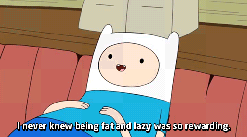

% L'évaluation paresseuse
% (ou comment faire les choses plus tard peut être une bonne idée)
% David Sferruzza

# À propos de moi

- [\@d_sferruzza](https://twitter.com/d\_sferruzza)
- [github.com/dsferruzza](https://github.com/dsferruzza)
- développeur et responsable R&D chez [Escale](http://www.escaledigitale.com)
- écrit des projets perso et pro en Scala et en Haskell (notamment) depuis ~ 1 an

# Évaluation paresseuse !=

Learn the difference, it could save your life

# Stratégie d'évaluation

- **quand** évaluer les arguments d'un appel de fonction
- **quel type de valeur** passer à la fonction

# Évaluation stricte

*strict evaluation, eager evaluation, greedy evaluation*

- **quand :** dès que l'expression peut être liée à une variable
- **quel type de valeurs :**
	- *call by value*
	- *call by reference*
	- *call by sharing*
	- ...

# Évaluation non stricte

*non-strict evaluation, lazy evaluation*

- **call by name :** les arguments sont substitués dans le corps de la fonction
- **call by need :** idem, avec *mémoïsation* (≈ mise en cache du résultat de l'évaluation des arguments)
- ...

# Évaluation paresseuse 

L'exécution d'un bout de code ne se fait pas avant que les résultats de ce bout de code ne soient réellement nécessaires.

# Pourquoi c'est bien ?

- **optimisation :** on veut éviter les calculs inutiles
- **maintenabilité :**
	- on peut exprimer des structures de données infinies
	- on peut définir des structures de contrôle comme des abstractions au lieu de primitives

# Questions ?

Twitter : \@d_sferruzza

Slides sur GitHub :

[dsferruzza/talk-evaluation-paresseuse-en-js](http://github.com/dsferruzza/talk-evaluation-paresseuse-en-js)

